## `$ id cyber-rage`

## `$ cat capabilities.log`

### ⚔️ Offensive & Defensive Security
Red-team tooling, vulnerability research, hardening frameworks. We break things to understand them, then build the fix — always in scope, always authorized.

### 🌐 Web Development
Full-stack builds across most languages and stacks — from single-file tools to multi-service platforms.

### 🛰️ Network & Privacy Engineering
Tunnel and config-panel infrastructure, multi-region routing, systems built to stay online and stay quiet.

### ➕ And More
If it compiles, runs in a terminal, or needs securing, it's probably already on the list.

## `$ ls stack/ --polyglot`

## `$ netstat --connections`

*Built in the dark. Shipped in silence.*

